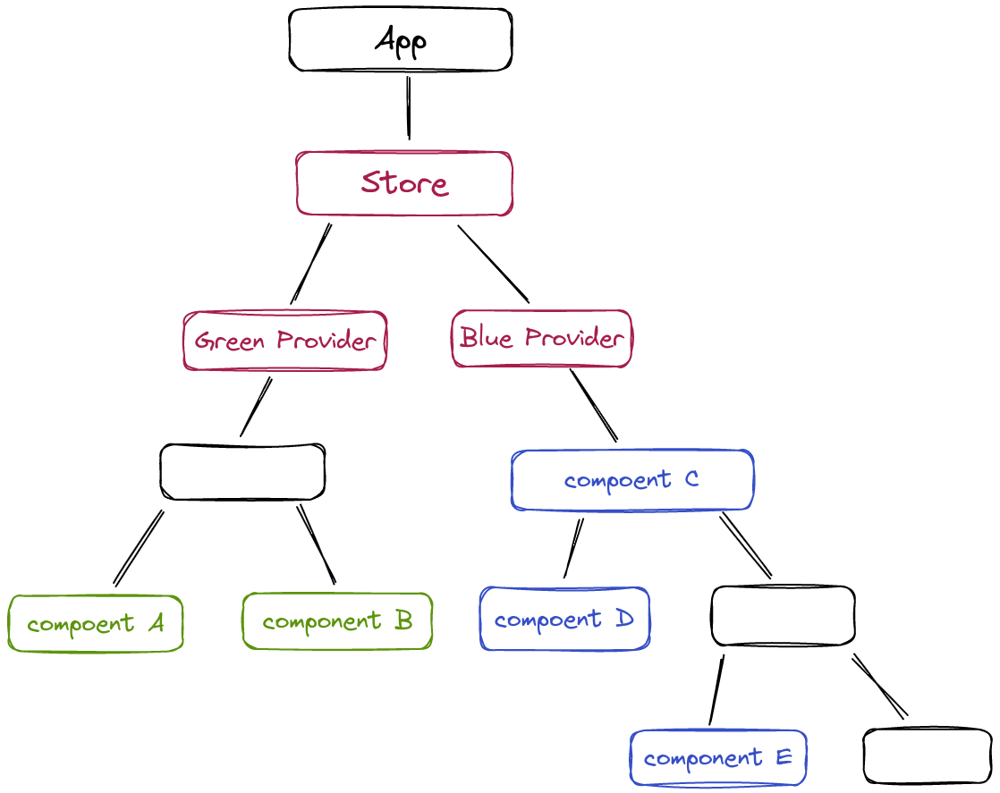

# DI in React - solving most painful troubles

As a frontend dev, I'm quite familiar with that painful side of the widespread practice of using state managers in React 
applications - it's not about rerenderings, different state managers wars or bundle sizes.

This issue is a common topic in casual conversations and job interviews, indicating that it is a significant concern 
for many developers.

I'm going to focus on the problem associated with the common practice of using a state manager in React 
applications - not about any specific state-manager, but about approaches of its usages.

## Average React state-management app troubles

Let's begin by considering a diagram of a React application (without having to read the code of yet 
another 'To-Do List' app).

We have a data store that is being used by five red components: A, B, C, D, and E. Each component has direct access 
to the store, like through the hooks `useReducer` or `useSelector` in Redux. The details of the state management
implementation are not important; what matters is that components have knowledge of the inner structure of the 
store - the location of the data they require.

It's important to note that A and B are related to the same business logic, but they are completely independent of C,
D, and E. They work with different interface elements and different store fields - this is not evident from the 
diagram, I need to highlight it (and it is needed to be highlighted in documentation and design - not self documented).

What's wrong with this app?
* It is difficult to determine which components are related by business logic and which are independent. For example, 
  there is no clear indication of the relationship between D and  E components, making them difficult to understand 
  without investigating their store usage.
* All components share common state - this can lead to bugs when one component affects others.
* Testing any component requires setting up a test scenario, creating mock data for the store, and checking expected 
  store state. This can be time-consuming and difficult to manage.
* It would be challenging for new team members to onboard, because they need to have a deep 
  understanding of the entire store and how it's used by all components. It's challenging to localize work part by part.
* Reusing components is difficult - the C component is tied to specific paths in the store. We can't reuse C 
  component with different data in store without code duplication.

What could be the reasons for these issues? Let's analyze the component's relations diagram in terms of 
[coupling](https://en.wikipedia.org/wiki/Coupling_(computer_programming)) and 
[cohesion](https://en.wikipedia.org/wiki/Cohesion_(computer_science)).

To put it simply, the coupling is a metric that refers to how much different modules of a system rely on each other, 
cohesion - refers to how closely related and focused the elements within a module are. Low coupling and high cohesion
are better in software development because they make the code easier to work with and reduce chances of unintended 
consequences.

The diagram depicts a simple structure with six components, but there are some issues:
* There are no clear modules in the code, with components A and B related in business-logic being lumped together
  with the others.
* Every component is aware of the structure of the store.

Despite these issues, it is still possible to work with this structure thanks to React's unidirectional data flow 
and the independence of components. However, this approach could lead to more bugs, a larger codebase, and a more 
fragile development process, as well as a longer onboarding for new team members.

## How to fix it?

### In theory 
The issues in the example are caused by a violation of the Dependency Inversion principle, which can be summarized 
as follows:

* High-level modules should not depend on low-level modules. Both should depend on abstractions.
* Abstractions should not depend on implementations. Implementations should depend on abstractions.

When a component directly accesses the store, it depends on the specific implementation of the store, including its 
paths and data. To address this, we need to make the component dependent only on abstractions and create a special 
way for the store to implement these abstractions.

### In practice

In other frameworks such as Ninject for .NET or Angular (highly recommended if you want to feel how DI works), a DI 
container works and replaces interfaces with class implementation during compile time. However, in React, which does 
not rely on classical compilation, a different approach is needed to implement dependency injection.

[React Context](https://react.dev/learn/passing-data-deeply-with-context) allows us to provide a value to a
component tree without having to pass it down through every level of the tree - it can be used in conjunction with 
other techniques to create a simple form of DI container.
We will use the context object as dependency marker (instead of interface) to resolve dependency inside container.
`useContext` hook or `Context.Consumer` can be used to get implementation through the context, while `Context.
Provider` can create a container for it.

To simplify component-store relationships, we will adopt a straightforward approach. Components that use the store will
require it as a specific abstraction based on business logic. For example, we can add two providers in the picture 
below, one for data used by A and B components and another for data used by C, D, and E components. The providers have 
direct access to the store, and therefore are colored red, while the other components are colored based on the 
corresponding provider.

What we got now:
* Separating components into independent green and blue groups, technical level dependencies between components are 
minimized and the risk of bugs is reduced (we almost exclude this kind of bugs).
* Tests writing is simplified now, as components don't rely on any store knowledge.
* These components can be easily reused with different data by changing the implementation on the provider level.
* This approach makes it easier to onboard new team members since they can understand and work on each module 
  separately.
* By analyzing the abstraction level used in components, it's easier to understand whether they are related or not.

The diagram of relations doesn't require any comments

In conclusion - following SOLID principles, using Context, and avoiding usage of store instance in every component, your 
codebase will become more manageable, reusable, and scalable.

While some developers may find the topics covered in this article to be obvious, I hope that others 
will find them useful.
